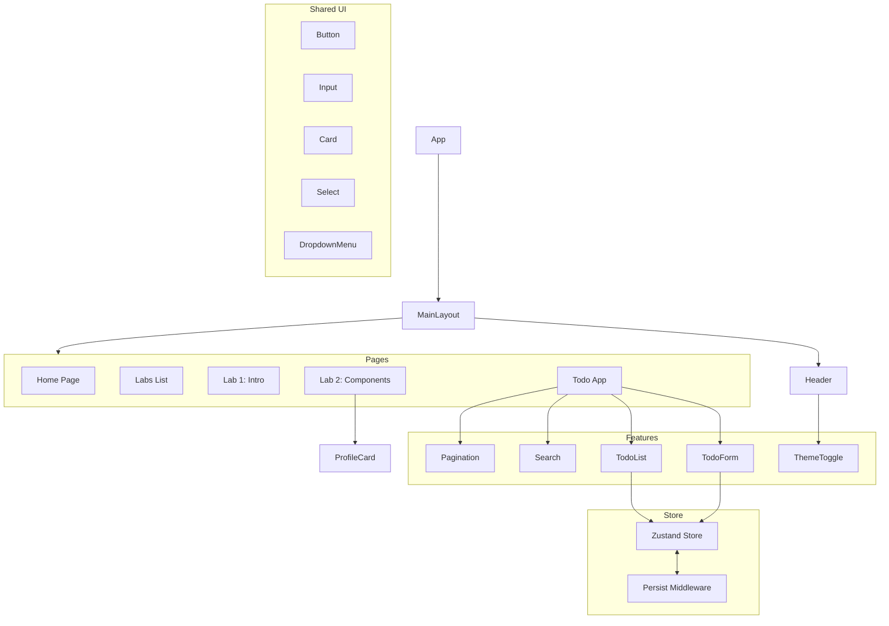

# React Labs Portfolio

> **Студент:** Маринич Данило  
> **Група:** КН-3

Фінальний проєкт з Веб React, що об'єднує всі лабораторні роботи в єдиний SPA-застосунок.

---

## 🏗 Component Tree & Data Flow

### Diagram

Архітектурні рішення (Feature-Sliced Design Lite)
Проєкт організовано відповідно до методології FSD у спрощеному вигляді для покращення масштабованості та підтримки коду.

app/ — Глобальні налаштування (store, router, types).

features/ — Бізнес-логіка та "розумні" компоненти (todos logic, theme logic).

pages/ — Компоненти сторінок, які компонують менші блоки для роутингу.

shared/ — Перевикористовувані UI-компоненти (shadcn/ui), утиліти та лейаути.

Технологічний стек
1. shadcn/ui + Tailwind CSS
Чому обрано:

Повний контроль: Компоненти копіюються безпосередньо в код проєкту (Headless UI), що дозволяє гнучко їх кастомізувати.

Продуктивність: Tailwind CSS забезпечує генерацію стилів on-demand (Atomic CSS), що зменшує розмір CSS-бандлу.

Доступність: Базується на Radix UI, гарантуючи підтримку WAI-ARIA.

Темна тема: Реалізована через CSS variables та клас dark.

2. Zustand (State Management)
Чому обрано замість Redux:

Простота та мінімалізм: Відсутність зайвого boilerplate-коду (немає providers, reducers, actions як окремих сутностей).

Хуки: Природна інтеграція з React через хук useAppStore.

Продуктивність: Компоненти підписуються лише на ті частини стейту, які вони використовують (selector-based updates), що мінімізує зайві ре-рендери.

Persist Middleware: Вбудований інструмент для автоматичного збереження стану в LocalStorage.

3. React Router v6
Чому обрано:

Декларативність: Зручна організація SPA-навігації.

Hooks API: Використання useNavigate, useLocation для програмної навігації.