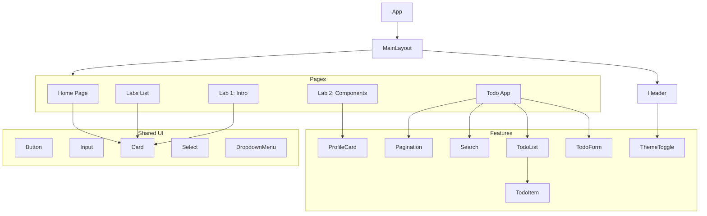

# React Labs Portfolio

> **Студент:** Маринич Данило  
> **Група:** КН-3

Фінальний проєкт з Веб React, що об'єднує всі лабораторні роботи в єдиний SPA-застосунок.

---

## 🏗 Component Tree & Data Flow

### Diagram

## Архітектурні рішення (Feature-Sliced Design Lite)

Проєкт організовано відповідно до методології FSD у спрощеному вигляді для покращення масштабованості та підтримки коду.

- **`app/`** — Глобальні налаштування (store, provider, types).
- **`features/`** — Бізнес-логіка, розбита за функціональними модулями (todos, theme, profile).
- **`pages/`** — Компоненти сторінок, які компонують менші блоки воєдино для роутингу.
- **`shared/`** — Перевикористовувані UI-компоненти (shadcn/ui), утиліти та хуки.
- **`widgets/`** (або Layout) — Великі самостійні блоки інтерфейсу, наприклад, Header.

---

## Технологічний стек

### 1. shadcn/ui + Tailwind CSS
**Чому обрано:**
- **Повний контроль:** Компоненти копіюються безпосередньо в код проєкту, що дозволяє гнучко їх кастомізувати під власні потреби.
- **Продуктивність:** Використання Tailwind CSS забезпечує менший розмір бандлу порівняно з великими бібліотеками на кшталт MUI.
- **Доступність:** Базується на Radix UI, що гарантує коректну підтримку скрінрідерів (Screen Readers) та навігації клавіатурою.
- **Темна тема:** Вбудована підтримка CSS-змінних дозволяє легко реалізувати перемикання тем.

### 2. Redux Toolkit
**Чому обрано:**
- **Стандарт індустрії:** Найпопулярніший інструмент для керування глобальним станом у React-екосистемі.
- **Зручність:** API `createSlice` значно зменшує кількість шаблонного коду (boilerplate).
- **Middleware:** Вбудований `listenerMiddleware` дозволяє ефективно обробляти сайд-ефекти, такі як збереження даних у LocalStorage.

### 3. React Router v7 (v6+)
**Чому обрано:**
- **Декларативність:** Сучасний підхід до маршрутизації в Single Page Application (SPA).
- **Функціональність:** Повна підтримка вкладених маршрутів та зручні хуки `useNavigate`, `useLocation`.

---

## Реалізований функціонал

### Todo List (Redux + CRUD)
Повноцінний менеджер завдань із використанням глобального стейту:
- **Create:** Додавання нових завдань до списку.
- **Read:** Відображення списку завдань із пагінацією та фільтрацією (пошук).
- **Update:** Редагування тексту завдання та перемикання статусу виконання (Done/Active).
- **Delete:** Видалення завдань зі списку.
- **Persistence:** Автоматичне збереження стану в `LocalStorage` через middleware для відновлення даних після перезавантаження.

### Dark/Light Mode
- Реалізовано через глобальний стан Redux (`themeSlice`).
- Працює шляхом додавання/видалення CSS-класу `dark` на кореневому елементі `html`.
- Обрана тема зберігається в браузері користувача.

### Компонентний підхід
- Всі стандартні HTML-теги (`button`, `input`, `select`) замінено на стилізовані, доступні компоненти з директорії `shared/ui`.
- Використано патерн розподілу на **Presentational** (відображення) та **Container** (логіка) компоненти.