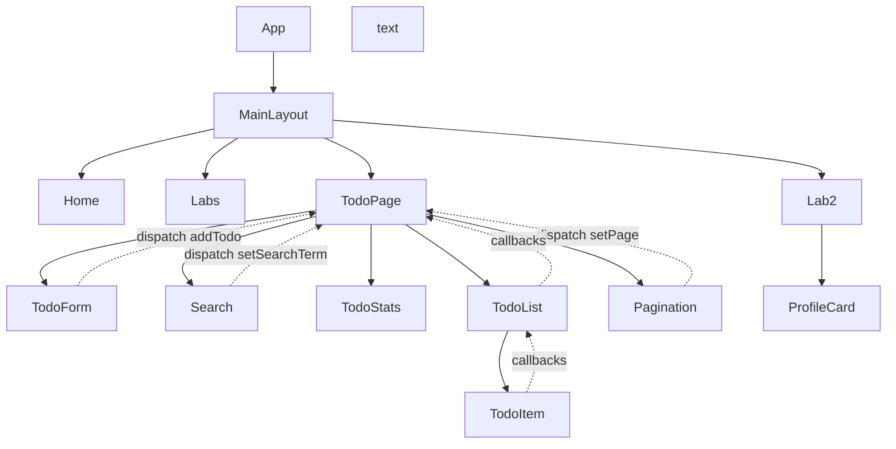

# React Labs Portfolio

> **Студент:** Маринич Данило  
> **Група:** КН-3

Фінальний проект з Веб React.

---

## Component Tree & Data Flow Diagram

### Diagram

### Пояснення компонентів

#### App
- Кореневий компонент з React Router
- Маршрути: `/` (Home), `/labs` (Labs), `/lab2` (Lab2), `/todo-list` (TodoPage)
- Обгортає все в MainLayout

#### MainLayout
- Спільна обгортка: Header + Container
- Header містить навігацію та перемикач теми
- Застосовує light/dark тему з Redux

#### Lab2
- Лабораторна #2: Profile Cards
- Масив `developers` (5 розробників)
- Рендерить ProfileCard для кожного через MUI Grid

#### ProfileCard
- Картка розробника з аватаром (DiceBear API)
- Props: `name`, `role`, `avatarUrl`, `bgColor`
- Hover-ефект: збільшення + тінь

#### TodoPage
- Smart-компонент для Todo (Labs 3-6)
- Читає Redux стан: `items`, `searchTerm`, `currentPage`, `limitPerPage`
- Обчислює `filteredTodos` (useMemo) та `paginatedTodos`
- Передає колбеки через useCallback: `handleToggle`, `handleDelete`, `handleEdit`

#### TodoForm
- Форма додавання задачі
- Локальний стан: `inputText`
- При submit → `dispatch(addTodo(inputText))`

#### Search
- Пошук по задачах в реальному часі
- При зміні → `dispatch(setSearchTerm(value))`
- Автоматично скидає сторінку на 1

#### TodoStats
- Статистика: Total / Completed / Active
- Використовує useMemo для підрахунку
- 3 MUI Chip з іконками

#### TodoList
- Контейнер списку задач
- Props: `todos[]`, `onToggle`, `onDelete`, `onEdit`
- React.memo з кастомним порівнянням
- Якщо порожньо → показує Paper з текстом

#### TodoItem
- Один елемент списку
- Локальний стан: `isEditing`, `editText`
- Checkbox → toggle, кнопки Edit/Delete
- Inline редагування з Enter/Escape
- React.memo з перевіркою todo та колбеків

#### Pagination
- Навігація між сторінками
- Кнопки Previous/Next (автоматично дизейбляться)
- Select для вибору ліміту: 5/10/20/50
- Відображення "Page X of Y"

## Архітектурні рішення

### Feature-Sliced структура
- `features/` — компоненти за функціональністю (profile, todos, theme)
- `pages/` — сторінки-маршрути
- `shared/` — спільні модулі (Layout, lib, theme)
- `app/` — Redux store та глобальні налаштування

### Smart/Presentational паттерн
- **Smart:** `TodoPage` — керує станом через Redux, обчислює дані
- **Presentational:** `TodoForm`, `TodoList`, `TodoItem` — отримують props, відображають UI

---

## Вибір бібліотек

### Redux Toolkit
**Чому:** Спрощений Redux з меншою кількістю boilerplate коду

### Material UI v6
**Чому:** Готові компоненти з адаптивністю та доступністю, вбудована темізація (light/dark)

### React Router v6
**Чому:** Стандарт для SPA-маршрутизації

---

## Проблеми та рішення

### Проблема 1: Ре-рендери всього списку
**Симптом:** При зміні однієї задачі (toggle/edit) весь TodoList ре-рендериться  
**Причина:** Нові референції колбеків на кожному рендері  
**Рішення:**
- `React.memo` на TodoList та TodoItem
- `useCallback` для всіх обробників (`handleToggle`, `handleDelete`, `handleEdit`)
- `useMemo` для фільтрації та пагінації

### Проблема 2: Втрата даних при перезавантаженні
**Симптом:** Todos зникають після refresh  
**Рішення:** Синхронізація Redux стану з LocalStorage через `safeLocalStorage`

### Проблема 3: Пагінація скидається при пошуку
**Причина:** Після фільтрації кількість сторінок змінюється  
**Рішення:** Автоматичне скидання на 1 сторінку в `setSearchTerm` reducer

---
