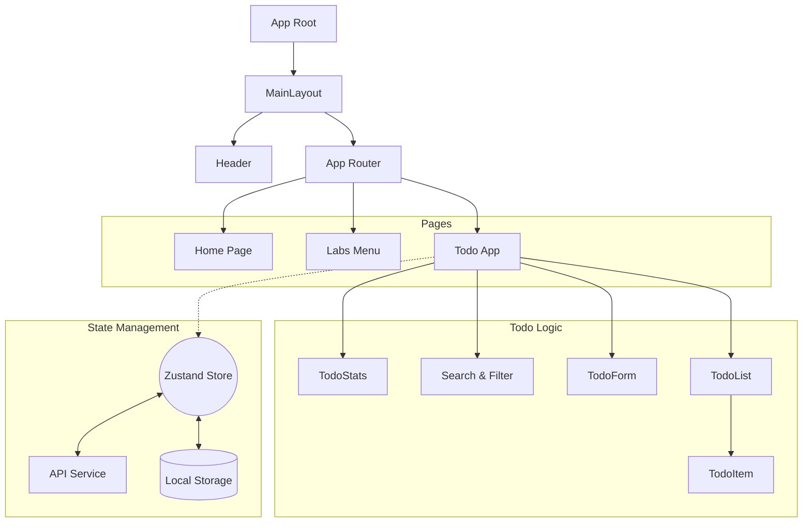

# 🎓 Student Portfolio & Todo App

> **Студент:** Маринич Данило
> **Група:** КН-3
> **Курс:** Web React

---

## 🚀 Demo
**Живий перегляд проєкту:** [🔗 Посилання на Vercel](https://react-final-proj-kn3.vercel.app/)

---

## 📝 Опис проєкту
Фінальний проєкт, що об'єднує серію лабораторних робіт у єдиний SPA-застосунок (Single Page Application).
Головна особливість — повноцінний **Todo List Manager**, реалізований з використанням сучасних архітектурних підходів, глобального стейт-менеджменту та адаптивного UI.

---

## 🏗 Architecture & Data Flow

Проєкт побудовано за принципами **Feature-Sliced Design (Lite)** для забезпечення масштабованості та чистоти коду.

### 🌳 Component Tree

## 📂 Структура папок

Проєкт організовано за модульним принципом для забезпечення масштабованості:

* `app/` — Глобальні налаштування застосунку (store, router, глобальні типи).
* `features/` — Бізнес-логіка та "розумні" компоненти (todos, profile). Тут знаходяться кастомні хуки (наприклад, `useTodos`), API-сервіси.
* `pages/` — Композиційний шар. Сторінки, які збирають компоненти з `features` та `shared` для роутингу.
* `shared/` — Перевикористовувані UI-компоненти (shadcn/ui), утиліти та загальні лейаути.

---

## 🛠 Технологічний стек та вибір інструментів

### 1. UI: shadcn/ui + Tailwind CSS
**Чому обрано:**
* **Повний контроль:** На відміну від бібліотек типу MUI, компоненти `shadcn/ui` не є "чорною скринькою". Я маю повний доступ до коду кожного компонента.
* **Performance:** Tailwind генерує стилі *on-demand*, що суттєво зменшує розмір CSS-бандлу.
* **Адаптивність:** Mobile-first підхід та адаптивна сітка реалізовані "з коробки".

### 2. State Management: Zustand
**Чому обрано замість Redux:**
* **Мінімалізм:** Відсутність зайвого boilerplate-коду (немає складних reducers, actions, providers).
* **Продуктивність:** Selector-based підписка компонентів запобігає зайвим ре-рендерам.
* **Persist Middleware:** Проста реалізація збереження стану в `localStorage` для відновлення сесії користувача після перезавантаження.

### 3. API & Async
* Використано паттерн **Service Layer** (`api.ts`), щоб повністю відділити логіку мережевих запитів від UI та State Management.
* Реалізовано централізовану обробку помилок та індикацію стану завантаження.

---

## 💡 Challenges & Solutions (Проблеми та рішення)

Під час розробки було вирішено кілька ключових технічних завдань:

### 1. SPA Routing на статичному хостингу (Vercel)
🔴 **Проблема:** При оновленні сторінки на глибокому маршруті (наприклад, `/labs/todo`) сервер повертав помилку **404**, оскільки намагався знайти фізичний файл за цим шляхом.
🟢 **Рішення:** Додано конфігурацію `vercel.json` з правилами `rewrites`. Вона перенаправляє всі запити на `index.html`, дозволяючи **React Router** коректно обробляти маршрутизацію на стороні клієнта.

### 2. Оптимізація ре-рендерів у списку завдань
🔴 **Проблема:** При введенні кожного символу в рядок пошуку відбувався повний перерахунок та ре-рендер усього списку завдань.
🟢 **Рішення:**
* Використано хук `useMemo` для мемоізації відфільтрованого масиву.
* Компоненти списку обгорнуто в `React.memo`.
* Логіка фільтрації винесена в кастомний хук `useTodos`.

### 3. Архітектурна чистота Store
🔴 **Проблема:** На початковому етапі логіка `fetch`-запитів та прямої маніпуляції DOM (зміна теми) знаходилась безпосередньо в Store, що порушувало принцип єдиної відповідальності.
🟢 **Рішення:**
* API-запити винесено в окремий сервіс `api.ts`.
* Управління класами теми (`dark`/`light`) делеговано компоненту `ThemeProvider`, який підписується на зміни стору і виконує side-effects.

### 4. Декомпозиція логіки теми (App.tsx vs ThemeProvider)
🔴 **Проблема:** Початкова реалізація перемикання теми (маніпуляція класами на `document.documentElement`) знаходилась безпосередньо в кореневому компоненті `App.tsx`. Це порушувало чистоту коду та змішувало логіку ініціалізації застосунку з логікою оформлення.
🟢 **Рішення:** Створено окремий компонент-обгортку **`ThemeProvider`**. Тепер:
* `App.tsx` залишається чистим і відповідає лише за роутинг та структуру.
* Логіка "side effects" (зміна DOM-елементів при зміні теми) повністю інкапсульована всередині провайдера.